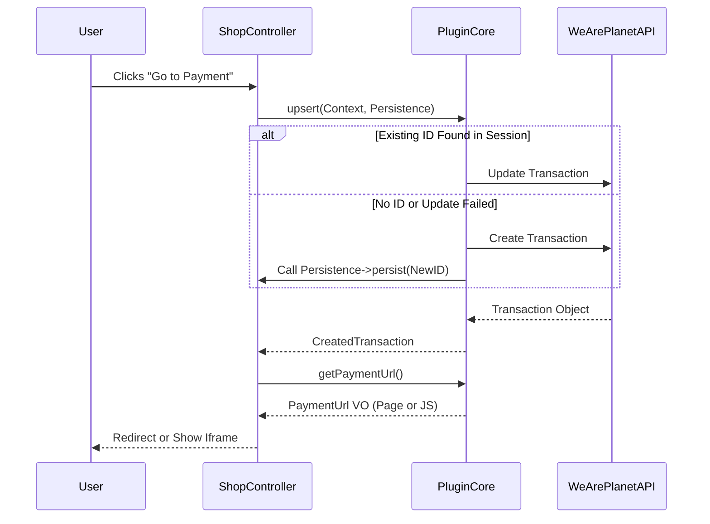

# Checkout Engine

The **Checkout Engine** handles the creation and management of transactions within the WeArePlanet ecosystem. It is designed to be **stateless** and **resilient**, allowing users to navigate back and forth in their checkout process without creating duplicate transactions or inconsistent states.

## Core Concepts

**1. Transaction Context (`TransactionContext`)**
This is a **Data Transfer Object (DTO)** that represents the state of the customer's cart. You must map your shop's internal order/quote object into this context before interacting with the library.

It contains:

* **Merchant Reference:** Your internal Order ID or Quote ID.
* **Line Items:** Products, fees, shipping costs, and discounts.
* **Billing/Shipping Address:** Geographic data (street, city, country, ...).
* **Customer Identity:** `PersonalDetails` (name, email, date of birth, ...) and `CompanyDetails` (organization, tax numbers) — kept separate from the addresses.
* **Settings:** Currency, Language, Success/Fail URLs (as `Url` value objects).

**2. The "Upsert" Strategy**
One of the hardest problems in payment integration is handling browser navigation.

* **Scenario:** A user clicks "Pay", goes to the payment page, realizes they forgot a coupon, hits "Back", adds the coupon, and clicks "Pay" again.
* **Problem:** Naive integrations create a second transaction.
* **Solution:** The **upsert** method. It attempts to **Update** the existing transaction associated with the cart. If that fails (or doesn't exist), it **Creates** a new one.

**3. Persistence Strategy**
The library creates transactions, but it does not know where to store the resulting WeArePlanet Transaction ID (Session? Database? Cache?).

You must implement the `TransactionPersistenceInterface` to bridge this gap. This ensures that subsequent calls reuse the same WeArePlanet Transaction ID.

**4. Integration Modes**
The engine supports multiple ways to present the payment form, controlled via **Settings**:

* **Payment Page:** Redirects the user to a hosted WeArePlanet URL.
* **Iframe:** Renders the form inside your shop via JavaScript.
* **Lightbox:** Renders the form in a modal overlay.

**5. Confirmation: Implicit vs Explicit**

The standard integration modes (**Payment Page**, **Iframe**, **Lightbox**) confirm the transaction **implicitly**: when the customer interacts with the payment widget, the WeArePlanet Portal confirms and processes the transaction on its own — shop code never needs to call `confirm()`.

The explicit `TransactionGatewayInterface::confirm($spaceId, $transactionId)` method is reserved for flows **without** a customer-facing widget:

* **Manual creation** — MOTO / backend admin orders placed by a merchant on behalf of the customer.
* **Server-side race-condition safety** — the gateway re-reads the transaction and confirms against its current version, so a concurrent modification fails fast instead of silently proceeding.

### Custom UI Rendering

The Iframe and Lightbox modes ship a ready-made script tag via `TransactionService::getPaymentUrl()`. If your frontend needs the raw pieces instead — a reactive framework (Vue, React, Alpine.js) that manages its own markup and state — use `IntegratedPaymentRenderService` directly:

```php
$data = $renderService->getMetadata($javascriptUrl, $method->id, 'iframe');
$jsTags = $renderService->renderJs($data, new RenderOptions(containerId: 'custom-payment-container'));
```

`getMetadata()` returns the `PaymentIntegrationData` DTO your frontend can key its own state off; `renderJs()`/`renderHtml()` turn it into the same script the built-in modes inject, so you own the surrounding HTML while the SDK still owns the payment widget itself. `RenderOptions` also accepts a `$nonce`, for shops running a strict CSP.

## Line Items

Each `LineItem` represents one row of the cart — a product, shipping, a fee, or a discount — distinguished by its `$type`:

- `LineItem::TYPE_PRODUCT` (the default)
- `LineItem::TYPE_SHIPPING`
- `LineItem::TYPE_FEE`
- `LineItem::TYPE_DISCOUNT` — use a **negative** `amountIncludingTax` for discount lines.

```php
$item = new LineItem();
$item->uniqueId = 'sku-123';
$item->amountIncludingTax = 150.00;
$item->type = LineItem::TYPE_PRODUCT; // TYPE_DISCOUNT, with a negative amount, for a discount line
$item->addTax(new Tax('VAT', 7.7));
```

### Per-Item Discounts

A `TYPE_DISCOUNT` line item represents a discount as its own row (e.g. a cart-wide coupon). If instead a single product's price was reduced (e.g. a sale price on that SKU), report the discount on `$item->discountIncludingTax` so the WeArePlanet Portal can display and reconcile it accurately — `$item->amountIncludingTax` should already reflect the discounted (final) price:

```php
$item->amountIncludingTax = 90.00;   // Final price, after the discount
$item->discountIncludingTax = 10.00; // The discount applied (original price was 100.00)
```

Compute this as the item's pre-discount amount minus `$item->amountIncludingTax` (e.g. for a Magento quote item, `rowTotalInclTax - amountIncludingTax`), or the discount amount directly for a shipping line. Leave it `null` (the default) if the item has no per-item discount.

### Custom Attributes

Attach shop-specific details (e.g. "Size: M", "Color: Blue") via `LineItemAttribute`, which the WeArePlanet Portal renders as `label: value` pairs:

```php
$item->attributes = new LineItemAttributeCollection(
    new LineItemAttribute(id: 'size', label: 'Size', value: 'M'),
    new LineItemAttribute(id: 'color', label: 'Color', value: 'Blue'),
);
```

`$id` and `$value` are self-sanitized on construction (`$id` is lowercased to alphanumeric characters and capped at 40 characters; `$value` is capped at 512 characters), so oversized or malformed shop data doesn't need to be validated beforehand.

### Taxes

Add one or more `Tax` entries via `$item->addTax()`:

```php
$item->addTax(new Tax('VAT', 7.7)); // 7.7% VAT
```

`$title` must be at least 2 characters — this is the one case that fails fast rather than silently truncating, since there's no sensible way to auto-correct a too-short title — and is capped at 40 characters if longer.

## Integration Guide

### Step 1: Implement Persistence

Create a class that implements `TransactionPersistenceInterface`. This allows the library to store the WeArePlanet Transaction ID against your cart/session.

```php
// The one method the host application must implement.
public function persist(int $transactionId): void
{
    $_SESSION['weareplanet_transaction_id'] = $transactionId;
}
```

### Step 2: Configure the Service

Inject the necessary dependencies. In a real application, use your Dependency Injection Container.

```php
use WeArePlanet\PluginCore\Sdk\WebServiceAPIV1\TransactionGateway;

$sdkProvider = new SdkProvider(new Settings($settingsProvider));
$gateway = new TransactionGateway($sdkProvider, $logger, $settings);
$transactionService = new TransactionService($gateway, $consistencyService, $logger);
```

### Currency-Aware Rounding

`LineItemConsistencyService` rounds line item amounts to the number of decimal places the transaction's currency actually uses, not always 2. Most currencies use 2 decimals, but some (e.g. `JPY`, `KRW`) have no minor unit at all, and others (e.g. `BHD`, `KWD`) use 3.

If your shop needs to round a monetary amount to the same currency-correct precision elsewhere (e.g. before displaying a price), use `CurrencyRoundingService` directly:

```php
use WeArePlanet\PluginCore\GlobalData\Currency\CurrencyRoundingService;

CurrencyRoundingService::round(1500.756, 'JPY'); // 1501.0   (0 decimals)
CurrencyRoundingService::round(10.1256, 'KWD');  // 10.126   (3 decimals)
CurrencyRoundingService::round(10.126, 'EUR');   // 10.13    (2 decimals, the default)
```

It lives alongside the `Currency` entity under [Global Data](../1-Getting-Started/GlobalData.md#currency-correct-rounding), which also documents `decimalsFor()` and `areAmountsEqual()`.

### Step 3: The Checkout Controller

Inside your "Pay" or "Review" controller action:

```php
$context->lineItems = new LineItemCollection(...$cart->getMappedLineItems());
$transaction = $transactionService->upsert($context, new ShopPersistenceStrategy());

// Integration mode decides what happens next: redirect, or inject into the page.
$paymentUrl = $transactionService->getPaymentUrl($spaceId, $transaction->id)->value;
```

👉 **See this in action:** [3_start_checkout.php](../examples/2-Checkout-Flow/3_start_checkout.php)

## Modifying the Cart

Once a transaction exists, the [Upsert Strategy](#core-concepts) above lets you re-read and update it instead of creating a duplicate — the "added a coupon, hit back" scenario.

👉 **See this in action:** [4_modify_cart.php](../examples/2-Checkout-Flow/4_modify_cart.php), which re-reads a session's transaction and updates its line items.

## Available Payment Methods

To find out which payment methods a customer can actually use for a given transaction, use `TransactionService::getAvailablePaymentMethods()`:

```php
use WeArePlanet\PluginCore\PaymentMethod\PaymentMethodSorting;

$methods = $transactionService->getAvailablePaymentMethods($spaceId, $transaction->id, PaymentMethodSorting::NAME);
```

This is **eligibility-aware**: it only returns methods that can actually be used for *this* transaction — filtered by the transaction's currency, amount, customer, and the space's integration mode. It's the correct method to call when rendering the payment method list at checkout.

> [!IMPORTANT]
> Don't confuse this with `PaymentMethodService::getPaymentMethods()` (see [Payment Method docs](PaymentMethod.md)). That method returns every payment method *configured* in the space, with no regard for whether a specific transaction is eligible for it — it's meant for admin/settings screens and for syncing the WeArePlanet Portal's configuration into your own database, not for deciding what to show a customer at checkout.

`$sortBy` controls ordering:
- **`PaymentMethodSorting::DEFAULT`** — whatever order the API returns.
- **`PaymentMethodSorting::NAME`** — still primarily ordered by the merchant's configured display order (`sortOrder`); alphabetical-by-title is only used to break ties between methods that share the same `sortOrder`. It is not a pure alphabetical sort.

👉 **See this in action:** [4_modify_cart.php](../examples/2-Checkout-Flow/4_modify_cart.php), which re-fetches the available methods after the cart changes — a re-fetch is needed because a cart change can shift eligibility (e.g. a new total crossing a payment method's amount limit).

## Confirming the Transaction

With a transaction created (and optionally modified), and the [available payment methods](#available-payment-methods) known, confirm the transaction in whichever [Integration Mode](#core-concepts) your space uses:

* **Payment Page** — see [5_confirm_payment_page.php](../examples/2-Checkout-Flow/5_confirm_payment_page.php).
* **Iframe** — see [5_confirm_iframe.php](../examples/2-Checkout-Flow/5_confirm_iframe.php).
* **Lightbox** — see [5_confirm_lightbox.php](../examples/2-Checkout-Flow/5_confirm_lightbox.php).
* **Manual / explicit `confirm()`** (MOTO, backend admin orders) — see [5_confirm_manual.php](../examples/2-Checkout-Flow/5_confirm_manual.php). Confirming alone does not charge the transaction; without a widget to trigger it implicitly, you must also apply its [charge flow](Charge.md#when-you-do-need-applyflow-explicit-flows) explicitly.
* **Custom UI** (a reactive frontend built on [IntegratedPaymentRenderService](#custom-ui-rendering)) — see [5_confirm_custom_ui.php](../examples/2-Checkout-Flow/5_confirm_custom_ui.php).

## Context Used by a Transaction

Once a transaction has been processed, it carries two small read-only value objects describing the context it actually ran in:

- **`TransactionEnvironment`** (`$transaction->environment`): the space view (`spaceViewId`) and language (`language`) the transaction ran under.
- **`TransactionPaymentMethod`** (`$transaction->paymentMethod`): the payment method configuration ID (`paymentMethodId`), connector ID (`connectorId`) and payment method image URL (`resolvedImageUrl`) the transaction was processed with.

```php
$transaction = $transactionService->getTransaction($spaceId, $transactionId);

$language = $transaction->environment?->language;           // e.g. 'de-CH'
$iconUrl  = $transaction->paymentMethod?->resolvedImageUrl; // null until a method is selected
```

See [6_transaction_context.php](../examples/2-Checkout-Flow/6_transaction_context.php) for a runnable script.

`$environment` is always present on a transaction you read back, though its individual properties are null when the API reported no explicit values. `$paymentMethod` is null while the customer has not yet chosen how to pay.

Both hold the values that were *used* for that one transaction rather than pointing at the merchant's live configuration. A merchant can rename a payment method, re-point it at another connector, replace its icon or disable it; a space view's branding and the shop's default language can change too. Copying the few values that were in effect means re-reading last year's order still describes the checkout the customer actually saw, and costs no extra API call.

When you want *current* values instead — a payment method's present title, description or availability — use `paymentMethodId` to look the live configuration up via the [Payment Method](PaymentMethod.md) feature.

## Holding an Order for Review

After a payment is captured, the WeArePlanet Portal may raise a **delivery indication** asking the merchant to confirm the order is safe to ship. See **[DeliveryIndication.md](DeliveryIndication.md)** for reading an indication and recording that decision via `DeliveryIndicationService`.

## Enabling Recurring Payments (Tokenization)

If you intend to charge this customer again later without their presence (subscriptions, unscheduled follow-up charges), set `tokenizationMode` on `TransactionContext` before creating the transaction:

```php
use WeArePlanet\PluginCore\Token\TokenizationMode as TokenizationModeEnum;

$context->tokenizationMode = TokenizationModeEnum::FORCE_CREATION;
```

This tells the API to generate a token from the customer's payment credentials once the transaction completes. It **cannot** be enabled retroactively after the fact — if you skip this at checkout, there is no token to charge later. See [Recurring Payments](../4-Background-Tasks/Recurring.md) for the full flow. The token that results — its versions, and how to resolve one back to a saved-card label — is covered in [Token](Token.md).

## Diagram


