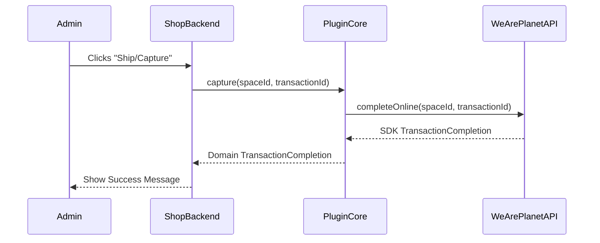
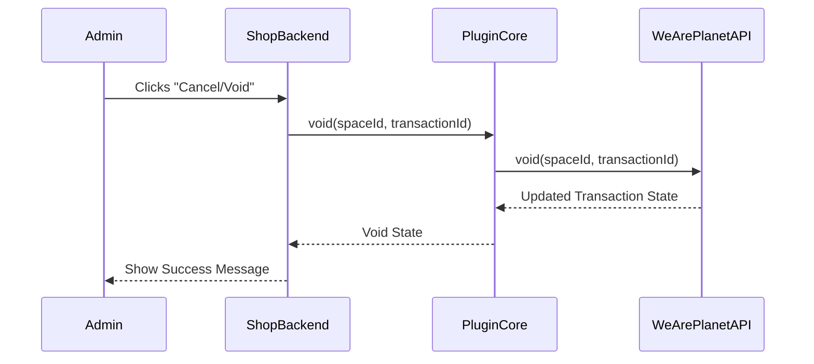

# Transaction Completion

**Completion** finalizes an authorized transaction, moving it from `AUTHORIZED` to a terminal state, in one of two ways:

1. **Capture** — collect the funds, typically when goods are shipped.
2. **Void** — cancel the transaction instead.

## Key Components

- **TransactionCompletionService**: The entry point — `capture()` (full or partial, via `CaptureRequest`), `void()`, the reads `find()` / `get()`, and `canComplete()` to test whether either is possible.
- **CaptureRequest**: Describes a partial capture — the `LineItemCollection` being captured now, an `isFinal` flag, and optional `externalId`/`merchantReference` metadata.
- **TransactionCompletionGatewayInterface**: The underlying API interaction the service delegates to.
- **TransactionCompletion**: The result — `id`, the linked transaction ID, `state` (`SUCCESSFUL`, `PENDING`, `FAILED`, ...), and the line items involved.

## Capturing a Transaction

```php
$completion = $completionService->capture($spaceId, $transactionId);

// No exception does not imply success — always inspect the state.
echo $completion->state->value;                      // SUCCESSFUL, FAILED, PENDING, SCHEDULED
echo $completion->failureReason?->localize('en-US'); // set when the gateway reported one
```

👉 **See this in action:** [capture.php](../examples/3-Post-Payment/capture.php)

## Voiding a Transaction

```php
$void = $completionService->void($spaceId, $transactionId);

echo $void->state->value;
echo $void->failureReason?->localize('en-US');
```

👉 **See this in action:** [void.php](../examples/3-Post-Payment/void.php)

## Partial Captures

Pass a `CaptureRequest` as `capture()`'s optional third argument to capture specific line items instead of the full authorized amount, e.g. when a shipment only fulfills part of an order:

```php
$request = new CaptureRequest(
    lineItems: new LineItemCollection($item),           // what is captured right now
    isFinal: false,                                     // more captures will follow
    externalId: "capture-{$transactionId}-shipment-1",  // idempotency key, required
);
```

A capture line item needs only `uniqueId`, `quantity` and `amountIncludingTax` set — nothing else is transmitted. The captured amount may be **less** than the line item's authorized value: that is what makes the capture partial. Omit `$request` (or pass one with an empty `LineItemCollection`) for a full capture instead.

> [!IMPORTANT]
> A capture requires the transaction to be `AUTHORIZED`, and accepting a capture moves it out of that state. Ask `$completionService->canComplete($transaction)` before capturing rather than assuming a second capture on the same transaction will be accepted — the API rejects the attempt outright when the transaction is no longer authorized.
>
> ```php
> if ($completionService->canComplete($transaction)) {
>     $completion = $completionService->capture($spaceId, $transaction->id, $request);
> }
> ```

Note the asymmetry with refunds: `RefundService::getRefundableLineItems()` nets off what has already been refunded, but there is no capture-side equivalent. A transaction's `lineItems` describe what was *authorized*, not what is still capturable, so they do not shrink after a capture.

> [!IMPORTANT]
> `externalId` is required for a partial capture and is the API's **idempotency key**: repeating a capture with an external ID the API already knows returns the original capture rather than taking the money again. Derive it from something stable on your side — a shipment ID, say — never from a fresh random value per attempt, or a retry after a timeout will capture twice. Constructing a partial `CaptureRequest` without one throws `\InvalidArgumentException` before any API call.

👉 **See this in action:** [partial_capture.php](../examples/3-Post-Payment/partial_capture.php)

## Reading a Completion

Completions are processed **asynchronously**: `capture()` may return a completion that is still `PENDING`, with the WeArePlanet Portal reporting the final outcome later via a `TransactionCompletion` webhook — see [Webhook Processor](../4-Background-Tasks/Webhook-Processor.md). The webhook payload carries the completion ID; use the gateway's read methods to verify the actual state rather than trusting the payload:

```php
// find(): returns null when the completion does not exist (404).
$completion = $completionService->find($spaceId, $completionId);

// get(): throws a CompletionException when it cannot be read.
$completion = $completionService->get($spaceId, $completionId);
```

👉 **See this in action:** [find_completion.php](../examples/3-Post-Payment/find_completion.php)

Reading the invoice a capture produced is covered separately — see [Invoice](Invoice.md).

## State Capability Predicates

Rather than hardcoding state comparisons, `Transaction\State` and `Transaction\Invoice\State` expose capability predicates that answer common business questions directly:

```php
if ($transaction->state->isPaidLike()) {
    // AUTHORIZED, COMPLETED or FULFILL: money is secured — safe to ship.
}

$transaction->state->allowsInvoiceManipulation(); // AUTHORIZED only
```

Before starting another capture, check whether the transaction's most recent invoice is still unresolved:

```php
if ($invoice->state->blocksCapture()) {
    // OPEN or OVERDUE: a prior invoice hasn't been resolved yet — wait before capturing again.
}
```

See [Document](Document.md) for the download-related predicates (`isInvoiceDownloadAllowed()`, `isPackingSlipDownloadAllowed()`).

## Flow Diagrams

**Capture:**



**Void:**


