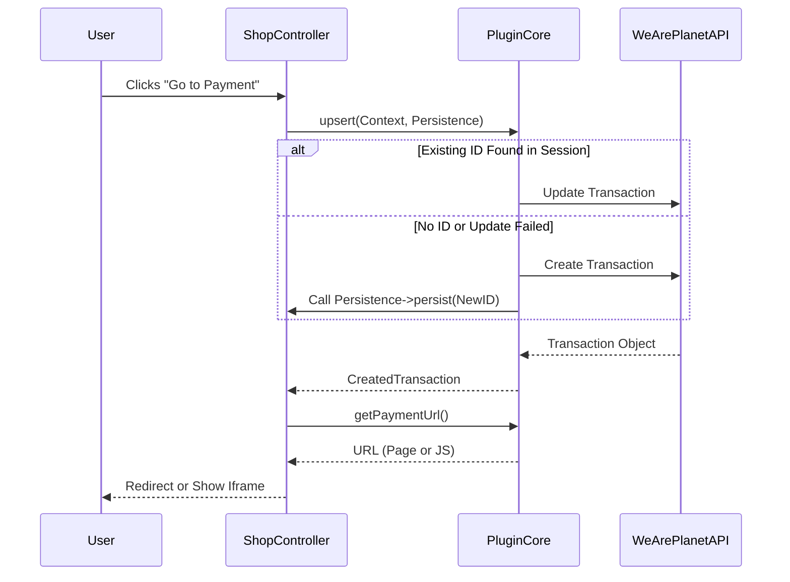

## Checkout Engine

The **Checkout Engine** handles the creation and management of transactions within the WeArePlanet ecosystem. It is designed to be **stateless** and **resilient**, allowing users to navigate back and forth in their checkout process without creating duplicate transactions or inconsistent states.

### Core Concepts

**1. Transaction Context (`TransactionContext`)**
This is a **Data Transfer Object (DTO)** that represents the state of the customer's cart. It is universal and immutable. You must map your shop's internal order/quote object into this context before interacting with the library.

It contains:

* **Merchant Reference:** Your internal Order ID or Quote ID.
* **Line Items:** Products, fees, shipping costs, and discounts.
* **Billing/Shipping Address:** Customer details.
* **Settings:** Currency, Language, Success/Fail URLs.

**2. The "Upsert" Strategy**
One of the hardest problems in payment integration is handling browser navigation.

* **Scenario:** A user clicks "Pay", goes to the payment page, realizes they forgot a coupon, hits "Back", adds the coupon, and clicks "Pay" again.
* **Problem:** Naive integrations create a second transaction.
* **Solution:** The **upsert** method. It attempts to **Update** the existing transaction associated with the cart. If that fails (or doesn't exist), it **Creates** a new one.

**3. Persistence Strategy**
The library creates transactions, but it does not know where to store the resulting WeArePlanet Transaction ID (Session? Database? Cache?).

You must implement the `TransactionPersistenceInterface` to bridge this gap. This ensures that subsequent calls reuse the same WeArePlanet Transaction ID.

**4. Integration Modes**
The engine supports multiple ways to present the payment form, controlled via **Settings**:

* **Payment Page:** Redirects the user to a hosted WeArePlanet URL.
* **Iframe:** Renders the form inside your shop via JavaScript.
* **Lightbox:** Renders the form in a modal overlay.

## Integration Guide

### Step 1: Implement Persistence

Create a class that implements `TransactionPersistenceInterface`. This allows the library to store the WeArePlanet Transaction ID against your cart/session.

```php
use WeArePlanet\PluginCore\Transaction\TransactionPersistenceInterface;

class ShopPersistenceStrategy implements TransactionPersistenceInterface
{
    public function persist(int $transactionId): void
    {
        // Example: Store in user session
        $_SESSION['weareplanet_transaction_id'] = $transactionId;
        
        // Example: Store in database quote
        // $this->quote->setWeArePlanetTransactionId($transactionId)->save();
    }
}
```

### Step 2: Configure the Service

Inject the necessary dependencies. In a real application, use your Dependency Injection Container.

```php
use WeArePlanet\PluginCore\Transaction\TransactionService;
use WeArePlanet\PluginCore\Settings\Settings;
use WeArePlanet\PluginCore\Sdk\SdkProvider;
use WeArePlanet\PluginCore\Sdk\WebServiceAPIV2\TransactionGateway;
// ... other imports

// 1. Setup SDK
$sdkProvider = new SdkProvider($credentials);

// 2. Setup Gateway (V2)
$gateway = new TransactionGateway($sdkProvider, $logger, $settings);

// 3. Setup Service
$transactionService = new TransactionService(
    $gateway,
    $consistencyService, // Handles line item rounding
    $logger
);
```

### Step 3: The Checkout Controller

Inside your "Pay" or "Review" controller action:

```php
// 1. Build Context from your Cart
$context = new TransactionContext();
$context->transactionId = $_SESSION['weareplanet_transaction_id'] ?? null; // Load existing if any
$context->merchantReference = $cart->getId();
$context->currencyCode = $cart->getCurrency();
$context->lineItems = $cart->getMappedLineItems();
// ... map addresses ...

// 2. Execute Upsert
// This will Update if possible, or Create if necessary.
// It automatically persists the ID if a new one is created.
$persistence = new ShopPersistenceStrategy();
$transaction = $transactionService->upsert($context, $persistence);

// 3. Get the Payment URL
$paymentUrl = $transactionService->getPaymentUrl($spaceId, $transaction->id);

// 4. Redirect or Render
if ($settings->getIntegrationMode() === IntegrationMode::PAYMENT_PAGE) {
    header("Location: " . $paymentUrl);
} else {
    // Pass $paymentUrl to your view for Iframe/Lightbox injection
    echo "<script src='$paymentUrl'></script>";
}
```

## Diagram


