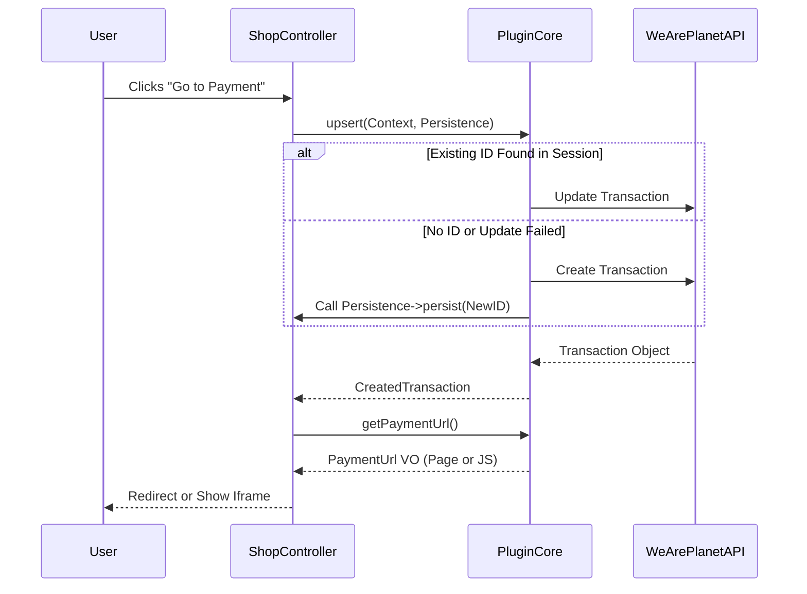

## Checkout Engine

The **Checkout Engine** handles the creation and management of transactions within the WeArePlanet ecosystem. It is designed to be **stateless** and **resilient**, allowing users to navigate back and forth in their checkout process without creating duplicate transactions or inconsistent states.

### Core Concepts

**1. Transaction Context (`TransactionContext`)**
This is a **Data Transfer Object (DTO)** that represents the state of the customer's cart. You must map your shop's internal order/quote object into this context before interacting with the library.

It contains:

* **Merchant Reference:** Your internal Order ID or Quote ID.
* **Line Items:** Products, fees, shipping costs, and discounts.
* **Billing/Shipping Address:** Geographic data (street, city, country, ...).
* **Customer Identity:** `PersonalDetails` (name, email, date of birth, ...) and `CompanyDetails` (organization, tax numbers) — kept separate from the addresses.
* **Settings:** Currency, Language, Success/Fail URLs (as `Url` value objects).

**2. The "Upsert" Strategy**
One of the hardest problems in payment integration is handling browser navigation.

* **Scenario:** A user clicks "Pay", goes to the payment page, realizes they forgot a coupon, hits "Back", adds the coupon, and clicks "Pay" again.
* **Problem:** Naive integrations create a second transaction.
* **Solution:** The **upsert** method. It attempts to **Update** the existing transaction associated with the cart. If that fails (or doesn't exist), it **Creates** a new one.

**3. Persistence Strategy**
The library creates transactions, but it does not know where to store the resulting WeArePlanet Transaction ID (Session? Database? Cache?).

You must implement the `TransactionPersistenceInterface` to bridge this gap. This ensures that subsequent calls reuse the same WeArePlanet Transaction ID.

**4. Integration Modes**
The engine supports multiple ways to present the payment form, controlled via **Settings**:

* **Payment Page:** Redirects the user to a hosted WeArePlanet URL.
* **Iframe:** Renders the form inside your shop via JavaScript.
* **Lightbox:** Renders the form in a modal overlay.

**5. Confirmation: Implicit vs Explicit**

The standard integration modes (**Payment Page**, **Iframe**, **Lightbox**) confirm the transaction **implicitly**: when the customer interacts with the payment widget, the portal confirms and processes the transaction on its own — shop code never needs to call `confirm()`.

The explicit `TransactionGatewayInterface::confirm($spaceId, $transactionId)` method is reserved for flows **without** a customer-facing widget:

* **Manual creation** — MOTO / backend admin orders placed by a merchant on behalf of the customer.
* **Server-side race-condition safety** — the gateway re-reads the transaction and confirms against its current version, so a concurrent modification fails fast instead of silently proceeding.

See [example/3_confirm_manual.php](example/3_confirm_manual.php) for a working script.

### Available Payment Methods

To find out which payment methods a customer can actually use for a given transaction, use `TransactionService::getAvailablePaymentMethods()`:

```php
use WeArePlanet\PluginCore\PaymentMethod\PaymentMethodSorting;

$methods = $transactionService->getAvailablePaymentMethods($spaceId, $transaction->id, PaymentMethodSorting::NAME);

foreach ($methods as $method) {
    echo $method->title->getDefault() . "\n";
}
```

This is **eligibility-aware**: it only returns methods that can actually be used for *this* transaction — filtered by the transaction's currency, amount, customer, and the space's integration mode. It's the correct method to call when rendering the payment method list at checkout.

> [!IMPORTANT]
> Don't confuse this with `PaymentMethodService::getPaymentMethods()` (see [Payment Method docs](../PaymentMethod/README.md)). That method returns every payment method *configured* in the space, with no regard for whether a specific transaction is eligible for it — it's meant for admin/settings screens and for syncing the portal's configuration into your own database, not for deciding what to show a customer at checkout.

`$sortBy` controls ordering:
- **`PaymentMethodSorting::DEFAULT`** — whatever order the API returns.
- **`PaymentMethodSorting::NAME`** — still primarily ordered by the merchant's configured display order (`sortOrder`); alphabetical-by-title is only used to break ties between methods that share the same `sortOrder`. It is not a pure alphabetical sort.

### Enabling Recurring Payments (Tokenization)

If you intend to charge this customer again later without their presence (subscriptions, unscheduled follow-up charges), set `tokenizationMode` on `TransactionContext` before creating the transaction:

```php
use WeArePlanet\PluginCore\Token\TokenizationMode as TokenizationModeEnum;

$context->tokenizationMode = TokenizationModeEnum::FORCE_CREATION;
```

This tells the API to generate a token from the customer's payment credentials once the transaction completes. It **cannot** be enabled retroactively after the fact — if you skip this at checkout, there is no token to charge later. See [Recurring Payments](../Recurring/README.md) for the full flow.

### Line Items

Each `LineItem` represents one row of the cart — a product, shipping, a fee, or a discount — distinguished by its `$type`:

- `LineItem::TYPE_PRODUCT` (the default)
- `LineItem::TYPE_SHIPPING`
- `LineItem::TYPE_FEE`
- `LineItem::TYPE_DISCOUNT` — use a **negative** `amountIncludingTax` for discount lines.

```php
use WeArePlanet\PluginCore\LineItem\LineItem;
use WeArePlanet\PluginCore\LineItem\LineItemCollection;
use WeArePlanet\PluginCore\Tax\Tax;

$item = new LineItem();
$item->uniqueId = 'sku-123';
$item->sku = 'sku-123';
$item->name = 'Swiss Watch';
$item->quantity = 1;
$item->amountIncludingTax = 150.00;
$item->type = LineItem::TYPE_PRODUCT;
$item->addTax(new Tax('VAT', 7.7));

$discount = new LineItem();
$discount->uniqueId = 'discount-summer';
$discount->sku = 'discount-summer';
$discount->name = 'Summer Sale -10%';
$discount->quantity = 1;
$discount->amountIncludingTax = -15.00; // Negative amount for a discount line
$discount->type = LineItem::TYPE_DISCOUNT;

$context->lineItems = new LineItemCollection($item, $discount);
```

#### Per-Item Discounts

A `TYPE_DISCOUNT` line item represents a discount as its own row (e.g. a cart-wide coupon). If instead a single product's price was reduced (e.g. a sale price on that SKU), report the discount on `$item->discountIncludingTax` so the portal can display and reconcile it accurately — `$item->amountIncludingTax` should already reflect the discounted (final) price:

```php
$item = new LineItem();
$item->uniqueId = 'sku-456';
$item->sku = 'sku-456';
$item->name = 'Leather Wallet';
$item->quantity = 1;
$item->amountIncludingTax = 90.00; // Final price, after the discount
$item->discountIncludingTax = 10.00; // The discount that was applied (original price was 100.00)
$item->type = LineItem::TYPE_PRODUCT;
```

Compute this as the item's pre-discount amount minus `$item->amountIncludingTax` (e.g. for a Magento quote item, `rowTotalInclTax - amountIncludingTax`), or the discount amount directly for a shipping line. Leave it `null` (the default) if the item has no per-item discount.

#### Custom Attributes

Attach shop-specific details (e.g. "Size: M", "Color: Blue") via `LineItemAttribute`, which the portal renders as `label: value` pairs:

```php
use WeArePlanet\PluginCore\LineItem\LineItemAttribute;
use WeArePlanet\PluginCore\LineItem\LineItemAttributeCollection;

$item->attributes = new LineItemAttributeCollection(
    new LineItemAttribute(id: 'size', label: 'Size', value: 'M'),
    new LineItemAttribute(id: 'color', label: 'Color', value: 'Blue'),
);
```

`$id` and `$value` are self-sanitized on construction (`$id` is lowercased to alphanumeric characters and capped at 40 characters; `$value` is capped at 512 characters), so oversized or malformed shop data doesn't need to be validated beforehand.

#### Taxes

Add one or more `Tax` entries via `$item->addTax()`:

```php
$item->addTax(new Tax('VAT', 7.7)); // 7.7% VAT
```

`$title` must be at least 2 characters — this is the one case that fails fast rather than silently truncating, since there's no sensible way to auto-correct a too-short title — and is capped at 40 characters if longer.

## Integration Guide

### Step 1: Implement Persistence

Create a class that implements `TransactionPersistenceInterface`. This allows the library to store the WeArePlanet Transaction ID against your cart/session.

```php
use WeArePlanet\PluginCore\Transaction\TransactionPersistenceInterface;

class ShopPersistenceStrategy implements TransactionPersistenceInterface
{
    public function persist(int $transactionId): void
    {
        // Example: Store in user session
        $_SESSION['weareplanet_transaction_id'] = $transactionId;
        
        // Example: Store in database quote
        // $this->quote->setWeArePlanetTransactionId($transactionId)->save();
    }
}
```

### Step 2: Configure the Service

Inject the necessary dependencies. In a real application, use your Dependency Injection Container.

```php
use WeArePlanet\PluginCore\Transaction\TransactionService;
use WeArePlanet\PluginCore\Settings\Settings;
use WeArePlanet\PluginCore\Sdk\SdkProvider;
use WeArePlanet\PluginCore\Sdk\WebServiceAPIV1\TransactionGateway;
// ... other imports

// 1. Setup SDK
$settings = new Settings($settingsProvider); // $settingsProvider implements SettingsProviderInterface
$sdkProvider = new SdkProvider($settings);

// 2. Setup Gateway (V1)
$gateway = new TransactionGateway($sdkProvider, $logger, $settings);

// 3. Setup Service
$transactionService = new TransactionService(
    $gateway,
    $consistencyService, // Handles line item rounding
    $logger
);
```

### Currency-Aware Rounding

`LineItemConsistencyService` rounds line item amounts to the number of decimal places the transaction's currency actually uses, not always 2. Most currencies use 2 decimals, but some (e.g. `JPY`, `KRW`) have no minor unit at all, and others (e.g. `BHD`, `KWD`) use 3.

If your shop needs to round a monetary amount to the same currency-correct precision elsewhere (e.g. before displaying a price), use `CurrencyRoundingService` directly:

```php
use WeArePlanet\PluginCore\Currency\CurrencyRoundingService;

CurrencyRoundingService::round(1500.756, 'JPY'); // 1501.0   (0 decimals)
CurrencyRoundingService::round(10.1256, 'KWD');  // 10.126   (3 decimals)
CurrencyRoundingService::round(10.126, 'EUR');   // 10.13    (2 decimals, the default)
```

### Step 3: The Checkout Controller

Inside your "Pay" or "Review" controller action:

```php
// 1. Build Context from your Cart
$context = new TransactionContext();
$context->transactionId = $_SESSION['weareplanet_transaction_id'] ?? null; // Load existing if any
$context->merchantReference = $cart->getId();
$context->currencyCode = $cart->getCurrency();
$context->lineItems = new LineItemCollection(...$cart->getMappedLineItems());

// 2. Execute Upsert
// This will Update if possible, or Create if necessary.
// It automatically persists the ID if a new one is created.
$persistence = new ShopPersistenceStrategy();
$transaction = $transactionService->upsert($context, $persistence);

// 3. Get the Payment URL
$paymentUrl = $transactionService->getPaymentUrl($spaceId, $transaction->id)->value;

// 4. Redirect or Render
if ($settings->getIntegrationMode() === IntegrationMode::PAYMENT_PAGE) {
    header("Location: " . $paymentUrl);
} else {
    // Pass $paymentUrl to your view for Iframe/Lightbox injection
    echo "<script src='$paymentUrl'></script>";
}
```

## Diagram


```mermaid
sequenceDiagram
    participant User
    participant ShopController
    participant PluginCore
    participant WeArePlanetAPI

    User->>ShopController: Clicks "Go to Payment"
    ShopController->>PluginCore: upsert(Context, Persistence)
    
    alt Existing ID Found in Session
        PluginCore->>WeArePlanetAPI: Update Transaction
    else No ID or Update Failed
        PluginCore->>WeArePlanetAPI: Create Transaction
        PluginCore->>ShopController: Call Persistence->persist(NewID)
    end
    
    WeArePlanetAPI-->>PluginCore: Transaction Object
    PluginCore-->>ShopController: CreatedTransaction
    
    ShopController->>PluginCore: getPaymentUrl()
    PluginCore-->>ShopController: PaymentUrl VO (Page or JS)
    
    ShopController-->>User: Redirect or Show Iframe
```
