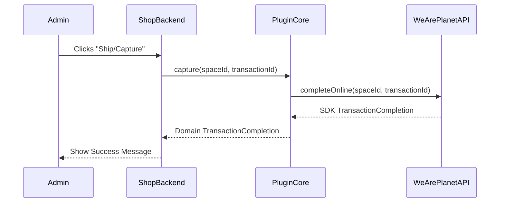
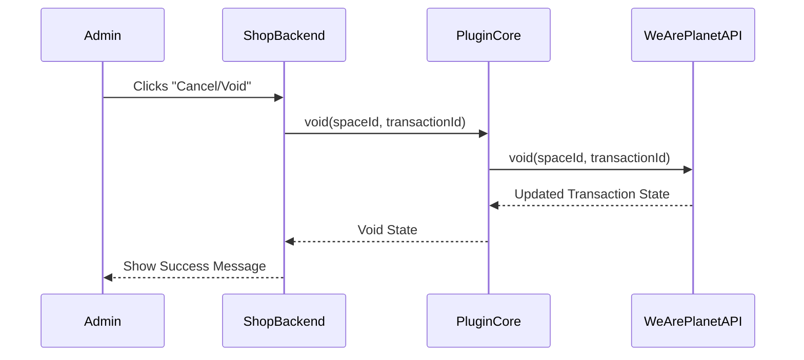

## Transaction Completion

The **Completion** functionality allows you to finalize the lifecycle of an authorized transaction. Completion can take two forms:

1. **Capture** - Finalize an authorized transaction by capturing the funds (typically when goods are shipped)
2. **Void** - Finalize an authorized transaction by cancelling it (if you decide not to proceed)

Both operations "complete" the transaction by moving it from an authorized state to a terminal state.

### Core Concepts

**1. Transaction Completion (`TransactionCompletion`)**
This is a **Domain Entity** that represents the result of a completion operation. It is independent of the SDK and contains:

* **ID:** The unique identifier of the completion.
* **Linked Transaction ID:** The ID of the transaction that was completed.
* **State:** The current state of the completion (e.g., SUCCESSFUL, PENDING, FAILED).
* **Line Items:** The list of items involved in the completion (useful for partial captures).

**2. The Completion Gateway**
Following the gateway pattern used in the checkout engine, the completion logic is encapsulated in the `TransactionCompletionGatewayInterface`. This allows the `TransactionService` to remain pure while delegating the SDK-specific calls to the infrastructure layer.

### Integration Guide

#### Step 1: Configure the Service

The `TransactionCompletionService` requires the `TransactionCompletionGatewayInterface` and a logger.

```php
use WeArePlanet\PluginCore\Transaction\Completion\TransactionCompletionService;
use WeArePlanet\PluginCore\Sdk\SdkV1\TransactionCompletionGateway;

// 1. Setup Gateways
$completionGateway = new TransactionCompletionGateway($sdkProvider);

// 2. Setup Service
$completionService = new TransactionCompletionService(
    $completionGateway,
    $logger
);
```

#### Step 2: Execute Completion

Completion can be performed in two ways:

**Capture - Finalize the transaction by capturing funds**

Typically triggered from a "Shipment" or "Capture" action in your shop's backend.

```php
try {
    // Perform the capture
    $completion = $completionService->capture($spaceId, $transactionId);

    echo "Capture successful! Completion ID: " . $completion->id;
} catch (TransactionException $e) {
    // Handle specific capture errors (e.g., transaction not in AUTHORIZED state)
    $logger->error("Capture failed: " . $e->getMessage());
}
```

**Void - Finalize the transaction by cancelling it**

Typically triggered when you decide not to proceed with the transaction.

```php
try {
    // Perform the void
    $state = $completionService->void($spaceId, $transactionId);

    echo "Void successful! State: " . $state;
} catch (TransactionException $e) {
    $logger->error("Void failed: " . $e->getMessage());
}
```

### Flow Diagrams

**Capture Flow:**



**Void Flow:**



### Running the Examples

**Capture Example:**

1. **Start Checkout**: Run `docs/Checkout/example/1_start_checkout.php`.
2. **Confirm & Pay**: Run `docs/Checkout/example/3_confirm_checkout.php`. Authorize the transaction.
3. **Capture**: Run `docs/Completion/example/capture.php`
    * You will need to manually set the `transactionId` in the script as it does not automatically pick up the session.

**Void Example:**

1. **Start Checkout**: Run `docs/Checkout/example/1_start_checkout.php`.
2. **Confirm & Pay**: Run `docs/Checkout/example/3_confirm_checkout.php`. Authorize the transaction.
3. **Void**: Run `docs/Completion/example/void.php`.
    * You will need to manually set the `transactionId` in the script as it does not automatically pick up the session.
