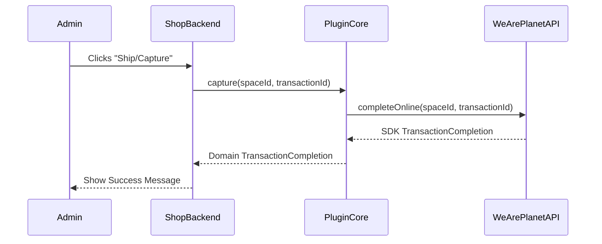
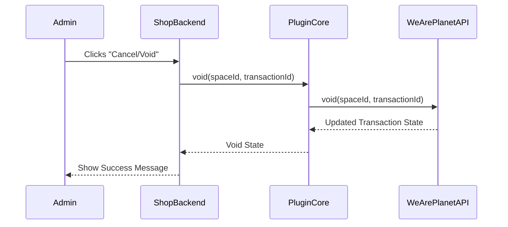

## Transaction Completion

The **Completion** functionality allows you to finalize the lifecycle of an authorized transaction. Completion can take two forms:

1. **Capture** - Finalize an authorized transaction by capturing the funds (typically when goods are shipped)
2. **Void** - Finalize an authorized transaction by cancelling it (if you decide not to proceed)

Both operations "complete" the transaction by moving it from an authorized state to a terminal state.

### Core Concepts

**1. Transaction Completion (`TransactionCompletion`)**
This is a **Domain Entity** that represents the result of a completion operation. It is independent of the SDK and contains:

* **ID:** The unique identifier of the completion.
* **Linked Transaction ID:** The ID of the transaction that was completed.
* **State:** The current state of the completion (e.g., SUCCESSFUL, PENDING, FAILED).
* **Line Items:** The list of items involved in the completion (useful for partial captures).

**2. The Completion Gateway**
Following the gateway pattern used in the checkout engine, the completion logic is encapsulated in the `TransactionCompletionGatewayInterface`. This allows the `TransactionService` to remain pure while delegating the SDK-specific calls to the infrastructure layer.

**3. Capture Request (`CaptureRequest`)**
`TransactionCompletionGatewayInterface::capture()` takes an optional third argument, a `CaptureRequest`, for line-item-level control over what gets captured:

* **`CaptureRequest`**: A DTO holding a `LineItemCollection` of the items to capture (empty = capture the full remaining amount), an `isFinal` flag, and optional `externalId`/`merchantReference` metadata.
* **`capture(spaceId, transactionId, ?CaptureRequest $request = null)`**: A single entry point for both full and partial captures. Omit `$request` (or pass one with an empty `LineItemCollection`) for a full capture; pass specific line items for a partial one.

See [Partial & Full Captures with `CaptureRequest`](#partial--full-captures-with-capturerequest) below.

### Integration Guide

#### Step 1: Configure the Service

The `TransactionCompletionService` requires the `TransactionCompletionGatewayInterface` and a logger.

```php
use WeArePlanet\PluginCore\Transaction\Completion\TransactionCompletionService;
use WeArePlanet\PluginCore\Sdk\WebServiceAPIV2\TransactionCompletionGateway;

// Setup Gateways
$completionGateway = new TransactionCompletionGateway($sdkProvider, $logger);

// Setup Service
$completionService = new TransactionCompletionService(
    $completionGateway,
    $logger
);
```

#### Step 2: Execute Completion

Completion can be performed in two ways:

**Capture - Finalize the transaction by capturing funds**

Typically triggered from a "Shipment" or "Capture" action in your shop's backend.

```php
try {
    // Perform the capture; returns a TransactionCompletion domain object
    $completion = $completionService->capture($spaceId, $transactionId);

    // No exception does not imply success: the completion may come back
    // FAILED or still PENDING/SCHEDULED. Always inspect the state.
    echo "Capture complete! ID: " . $completion->id . ", State: " . $completion->state->value;

    // If the gateway reported a failure reason, localize it for the shop locale
    if ($completion->failureReason !== null) {
        echo "Failure reason: " . $completion->failureReason->localize('en-US');
    }
} catch (TransactionException $e) {
    // Handle specific capture errors (e.g., transaction not in AUTHORIZED state)
    $logger->error("Capture failed: " . $e->getMessage());
}
```

**Void - Finalize the transaction by cancelling it**

Typically triggered when you decide not to proceed with the transaction.

```php
try {
    // Perform the void; returns a TransactionVoid domain object
    $void = $completionService->void($spaceId, $transactionId);

    echo "Void successful! State: " . $void->state->value;

    // If the gateway reported a failure reason, localize it for the shop locale
    if ($void->failureReason !== null) {
        echo "Failure reason: " . $void->failureReason->localize('en-US');
    }
} catch (TransactionException $e) {
    $logger->error("Void failed: " . $e->getMessage());
}
```

### Partial & Full Captures with `CaptureRequest`

`CaptureRequest` lets you capture specific line items instead of the transaction's full authorized amount — e.g. when a shipment only fulfills part of an order. Build a `LineItemCollection` describing exactly what is being captured now, and pass it to the gateway's `capture()` method (not the Service, which only exposes the simple `capture($spaceId, $transactionId)`/`void()` calls with no line-item control):

```php
use WeArePlanet\PluginCore\LineItem\LineItem;
use WeArePlanet\PluginCore\LineItem\LineItemCollection;
use WeArePlanet\PluginCore\Transaction\Completion\CaptureRequest;

// Describe what is being captured right now — e.g. 1 of the 2 units ordered.
$item = new LineItem();
$item->uniqueId = 'sku-123';
$item->quantity = 1;
$item->amountIncludingTax = 25.00; // the amount being captured for this line

$lineItems = new LineItemCollection($item);

$request = new CaptureRequest(
    lineItems: $lineItems,
    isFinal: false, // more captures will follow for the remaining unit(s)
    merchantReference: 'shipment-1',
);

try {
    $completion = $completionGateway->capture($spaceId, $transactionId, $request);
    echo "Capture created! ID: " . $completion->id . ", State: " . $completion->state->value;
} catch (CompletionException $e) {
    $logger->error("Capture failed: " . $e->getMessage());
}
```

For a full capture, simply omit the third argument:

```php
$completion = $completionGateway->capture($spaceId, $transactionId);
```

See [example/partial_capture.php](example/partial_capture.php) for a full runnable script.

### Flow Diagrams

**Capture Flow:**


```mermaid
sequenceDiagram
    participant Admin
    participant ShopBackend
    participant PluginCore
    participant WeArePlanetAPI

    Admin->>ShopBackend: Clicks "Ship/Capture"
    ShopBackend->>PluginCore: capture(spaceId, transactionId)
    PluginCore->>WeArePlanetAPI: completeOnline(spaceId, transactionId)
    WeArePlanetAPI-->>PluginCore: SDK TransactionCompletion
    PluginCore-->>ShopBackend: Domain TransactionCompletion
    ShopBackend-->>Admin: Show Success Message
```

**Void Flow:**


```mermaid
sequenceDiagram
    participant Admin
    participant ShopBackend
    participant PluginCore
    participant WeArePlanetAPI

    Admin->>ShopBackend: Clicks "Cancel/Void"
    ShopBackend->>PluginCore: void(spaceId, transactionId)
    PluginCore->>WeArePlanetAPI: void(spaceId, transactionId)
    WeArePlanetAPI-->>PluginCore: Updated Transaction State
    PluginCore-->>ShopBackend: Void State
    ShopBackend-->>Admin: Show Success Message
```

### Running the Examples

**Capture Example:**

1. **Start Checkout**: Run `docs/Checkout/example/1_start_checkout.php`.
2. **Confirm & Pay**: Run one of the `docs/Checkout/example/3_confirm_*.php` scripts matching your integration mode (e.g. `3_confirm_manual.php`). Authorize the transaction.
3. **Capture**: Run `docs/Completion/example/capture.php`
    * You will need to manually set the `transactionId` in the script as it does not automatically pick up the session.

**Void Example:**

1. **Start Checkout**: Run `docs/Checkout/example/1_start_checkout.php`.
2. **Confirm & Pay**: Run one of the `docs/Checkout/example/3_confirm_*.php` scripts matching your integration mode (e.g. `3_confirm_manual.php`). Authorize the transaction.
3. **Void**: Run `docs/Completion/example/void.php`.
    * You will need to manually set the `transactionId` in the script as it does not automatically pick up the session.

**Partial Capture Example:**

1. **Start Checkout**: Run `docs/Checkout/example/1_start_checkout.php`.
2. **Confirm & Pay**: Run one of the `docs/Checkout/example/3_confirm_*.php` scripts matching your integration mode (e.g. `3_confirm_manual.php`). Authorize the transaction.
3. **Partial Capture**: Run `docs/Completion/example/partial_capture.php [transaction_id]` to capture a single line item via `CaptureRequest`.

**Invoice Example (Reading the Captured Reality):**

1. Complete a capture as described above.
2. Run `docs/Completion/example/fetch_invoice.php [transaction_id]` to fetch the invoice that resulted from the capture.

See **[Invoice.md](Invoice.md)** for the full documentation of the read-only `Transaction\Invoice` domain (states, gateway methods, and how to locate the invoice for a transaction).

## State Capability Predicates

Rather than hardcoding state comparisons in your shop's integration code, `Transaction\State` and `Transaction\Invoice\State` expose capability predicates that answer common business questions directly:

```php
use WeArePlanet\PluginCore\Transaction\State as TransactionState;

if ($transaction->state->isPaidLike()) {
    // AUTHORIZED, COMPLETED, or FULFILL: money is secured — safe to ship/fulfill.
}

if ($transaction->state->allowsInvoiceManipulation()) {
    // AUTHORIZED only: the portal hasn't generated its own invoice yet, so
    // your shop's local bookkeeping can still freely create or cancel one.
}
```

Before starting another capture, check whether the transaction's most recent invoice is still unresolved:

```php
if ($invoice->state->blocksCapture()) {
    // OPEN or OVERDUE: a prior invoice hasn't been resolved yet — wait before capturing again.
}
```

See **[Document documentation](../Document/README.md)** for the download-related predicates (`isInvoiceDownloadAllowed()`, `isPackingSlipDownloadAllowed()`).

## Verifying an Existing Completion

Completions are processed **asynchronously**: `capture()` may return a completion that is still `PENDING`, and the portal reports the final outcome later via a `TransactionCompletion` webhook. See [Webhook Processor](../Webhook/Processor/README.md) for handling that incoming notification. The webhook payload carries the completion ID — use the gateway's read methods to verify the actual state:

```php
// find(): returns null when the completion does not exist (404).
$completion = $completionGateway->find($spaceId, $completionId);

// get(): throws a CompletionException when it cannot be read.
$completion = $completionGateway->get($spaceId, $completionId);

echo $completion->state->value; // e.g. SUCCESSFUL, FAILED, PENDING
```

This is primarily intended for **asynchronous webhook verification** — re-reading the source of truth from the API instead of trusting the webhook payload. All failures are wrapped in the domain `CompletionException`.

**Completion Verification Example:**

Run `docs/Completion/example/find_completion.php [completion_id]` after a capture to re-read the completion by its ID.
