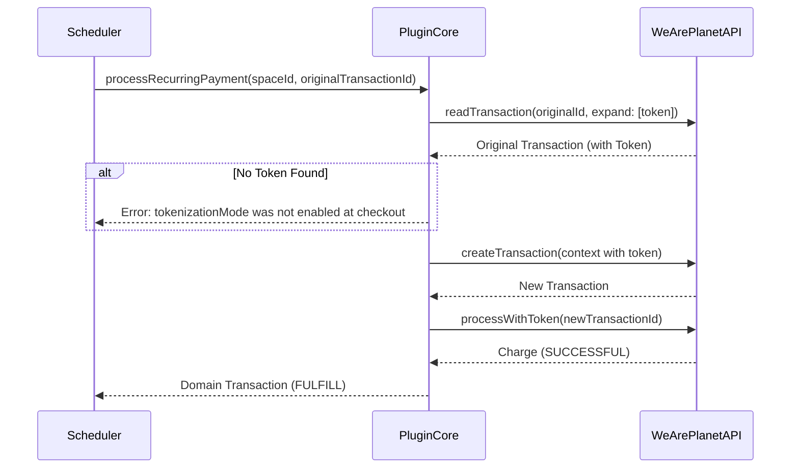

## Recurring Payments

The **Recurring Payment** functionality enables Merchant Initiated Transactions (MIT). This allows charging an existing transaction (representing a saved payment token) immediately without requiring direct user interaction in the browser.

This is commonly used for subscription renewals or unscheduled subsequent charges where the cardholder is not present.

### Core Concepts

**1. Tokenization at Checkout (Prerequisite)**
The original transaction **must** be created with `tokenizationMode = FORCE_CREATION`. This tells the API to automatically generate a token with the customer's stored payment credentials when the payment completes. Without this, there is no token to charge against.

**2. Process via Token**
The recurring payment process creates a new transaction linked to the existing token, then charges it using `processWithToken`. This leverages the stored payment credentials from the token.

**3. The Recurring Gateway**
The logic is encapsulated in the `RecurringTransactionGatewayInterface`. This interface exposes a specific method for processing recurring charges: `processRecurringPayment`.

> [!IMPORTANT]
> Recurring payments will **fail** if the original transaction was not created with tokenization enabled. The error message will indicate that no token exists.

### Integration Guide

#### Step 0: Enable Tokenization at Checkout

When creating the original transaction, set `tokenizationMode`:

```php
use WeArePlanet\PluginCore\Token\TokenizationMode as TokenizationModeEnum;

$context = new TransactionContext();
// ... set other fields ...
$context->tokenizationMode = TokenizationModeEnum::FORCE_CREATION;
```

#### Step 1: Configure the Service

 Use `RecurringTransactionService`.

 ```php
 use WeArePlanet\PluginCore\Transaction\RecurringTransactionService;
 use WeArePlanet\PluginCore\Transaction\TransactionService;
 use WeArePlanet\PluginCore\Token\TokenService;
 use WeArePlanet\PluginCore\Sdk\SdkV2\RecurringTransactionGateway;
 use WeArePlanet\PluginCore\Sdk\SdkV2\TokenGateway;
 
 // 1. Setup Gateways
 $recurringGateway = new RecurringTransactionGateway($sdkProvider, $logger);
 $tokenGateway = new TokenGateway($sdkProvider, $logger);
 
 // 2. Setup Services
 $tokenService = new TokenService($tokenGateway, $logger);

 // 3. Instantiate Recurring Service
 $recurringService = new RecurringTransactionService(
     $transactionService,
     $recurringGateway,
     $tokenService,
     $logger
 );
 ```

#### Step 2: Execute Recurring Payment

 The recurring payment is triggered using the original transaction ID and the space ID.

 ```php
 try {
     // Perform the recurring charge
     $newTransaction = $recurringService->processRecurringPayment($spaceId, $originalTransactionId);
 
     echo "Recurring payment processed! New Transaction ID: " . $newTransaction->id;
 } catch (\Throwable $e) {
     $logger->error("Recurring payment failed: " . $e->getMessage());
 }
 ```

### Flow Diagram



### Running the Example

A working example is provided in the `example` directory.

> [!IMPORTANT]
> The recurring payment example requires a transaction that was created **with tokenization enabled** and has already been paid. You must run the updated Checkout examples first to create such a transaction.

1. **Start Checkout**: Run `docs/Checkout/example/1_start_checkout.php` (now includes `FORCE_CREATION` tokenization).
2. **Confirm & Pay**: Run `docs/Checkout/example/3_confirm_checkout.php` and follow the link to pay.
3. **Trigger Recurring**: Run `docs/Recurring/example/recurring.php`.
    * This script automatically detects the active session from the Checkout example.
    * Alternatively, you can pass the transaction ID manually:

      ```bash
      php recurring.php <transaction_id>
      ```
