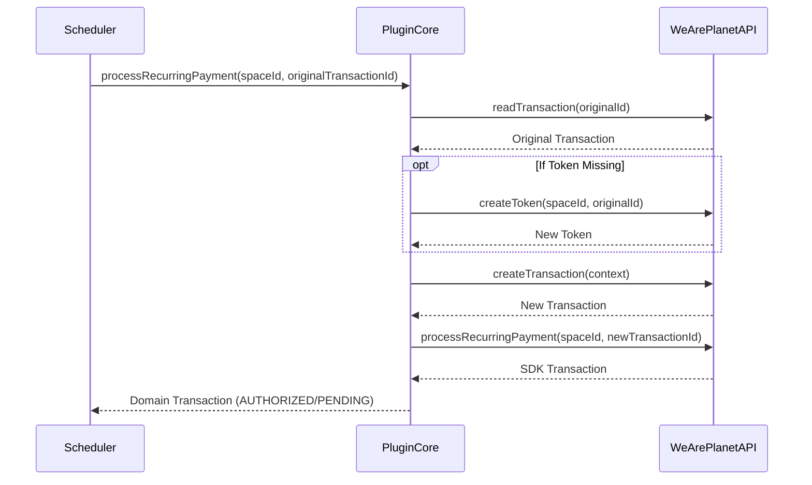

## Recurring Payments

The **Recurring Payment** functionality enables Merchant Initiated Transactions (MIT). This allows charging an existing transaction (representing a saved payment token) immediately without requiring direct user interaction in the browser.

This is commonly used for subscription renewals or unscheduled subsequent charges where the cardholder is not present.

### Core Concepts

**1. Process Without User Interaction**
The recurring payment process triggers a charge attempt on a previously successful transaction. It uses the payment information linked to that transaction.

**2. The Recurring Gateway**
The logic is encapsulated in the `RecurringTransactionGatewayInterface`. This interface exposes a specific method for processing recurring charges: `processRecurringPayment`.

**3. Automatic Token Creation**
If the original transaction does not have a saved token, the service attempts to create one automatically before processing the recurring payment. This ensures that subsequent charges can still be performed even if the initial payment wasn't tokenized explicitly.

### Integration Guide

#### Step 1: Configure the Service

 Use `RecurringTransactionService`.

 ```php
 use WeArePlanet\PluginCore\Transaction\RecurringTransactionService;
 use WeArePlanet\PluginCore\Transaction\TransactionService;
 use WeArePlanet\PluginCore\Token\TokenService;
 use WeArePlanet\PluginCore\Sdk\WebServiceAPIV1\RecurringTransactionGateway;
 use WeArePlanet\PluginCore\Sdk\WebServiceAPIV1\TokenGateway;
 
 // 1. Setup Gateways
 $recurringGateway = new RecurringTransactionGateway($sdkProvider, $logger);
 $tokenGateway = new TokenGateway($sdkProvider, $logger);
 
 // 2. Setup Services
 $tokenService = new TokenService($tokenGateway, $logger);

 // 3. Instantiate Recurring Service
 $recurringService = new RecurringTransactionService(
     $transactionService,
     $recurringGateway,
     $tokenService,
     $logger
 );
 ```

#### Step 2: Execute Recurring Payment

 The recurring payment is triggered using the original transaction ID and the space ID.

 ```php
 try {
     // Perform the recurring charge
     $newTransaction = $recurringService->processRecurringPayment($spaceId, $originalTransactionId);
 
     echo "Recurring payment processed! New Transaction ID: " . $newTransaction->id;
 } catch (\Throwable $e) {
     $logger->error("Recurring payment failed: " . $e->getMessage());
 }
 ```

### Flow Diagram



### Running the Example

A working example is provided in the `example` directory.

> [!IMPORTANT]
> The recurring payment example relies on a transaction that has already been authorized. You should run the Checkout examples first, complete the payment in your browser, and then run the recurring script.

1. **Start Checkout**: Run `docs/Checkout/example/1_start_checkout.php`.
2. **Confirm & Pay**: Run `docs/Checkout/example/3_confirm_checkout.php` and follow the link to pay.
3. **Trigger Recurring**: Run `docs/Recurring/example/recurring.php`.
    * This script automatically detects the active session from the Checkout example.
    * Alternatively, you can pass the transaction ID manually:

      ```bash
      php recurring.php <transaction_id>
      ```
