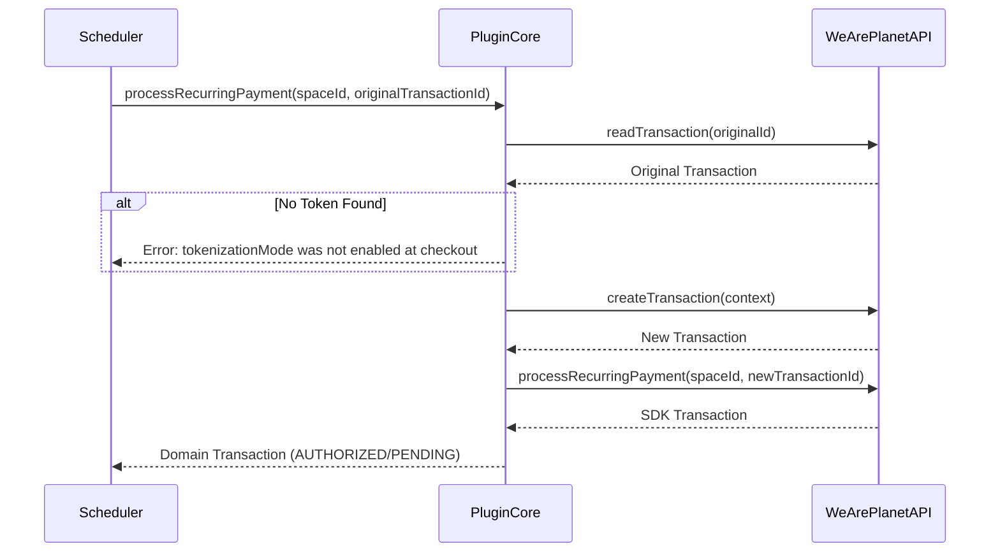

## Recurring Payments

The **Recurring Payment** functionality enables Merchant Initiated Transactions (MIT). This allows charging an existing transaction (representing a saved payment token) immediately without requiring direct user interaction in the browser.

This is commonly used for subscription renewals or unscheduled subsequent charges where the cardholder is not present.

### Core Concepts

**1. Tokenization at Checkout (Prerequisite)**
The original transaction **must** be created with `tokenizationMode = FORCE_CREATION`. This tells the API to automatically generate a token with the customer's stored payment credentials when the payment completes. Without this, there is no token to charge against, and a token cannot be created retroactively after the fact.

**2. Process Without User Interaction**
The recurring payment process triggers a charge attempt on a previously successful transaction. It uses the payment information linked to that transaction.

**3. The Recurring Gateway**
The logic is encapsulated in the `RecurringTransactionGatewayInterface`. This interface exposes a specific method for processing recurring charges: `processRecurringPayment`.

**4. Token and Billing Address Requirements**
For a recurring payment to succeed, a valid payment token and billing address must be present on the original transaction. Following the Fail Fast approach, the service throws a domain exception with both a technical message and a localized reason: a `MissingTokenException` (in `WeArePlanet\PluginCore\Token\Exception`) when the token is missing, and a `TransactionException` (in `WeArePlanet\PluginCore\Transaction\Exception`) when the billing address is missing.

> [!IMPORTANT]
> Recurring payments will **fail** if the original transaction was not created with tokenization enabled. The error message will indicate that no token exists.

### Integration Guide

#### Step 0: Enable Tokenization at Checkout

When creating the original transaction, set `tokenizationMode`:

```php
use WeArePlanet\PluginCore\Token\TokenizationMode as TokenizationModeEnum;

$context = new TransactionContext();
// ... set other fields ...
$context->tokenizationMode = TokenizationModeEnum::FORCE_CREATION;
```

#### Step 1: Configure the Service

 Use `RecurringTransactionService`.

 ```php
 use WeArePlanet\PluginCore\Transaction\RecurringTransactionService;
 use WeArePlanet\PluginCore\Transaction\TransactionService;
 use WeArePlanet\PluginCore\Sdk\WebServiceAPIV1\RecurringTransactionGateway;
 
 // Setup Gateway
 $recurringGateway = new RecurringTransactionGateway($sdkProvider, $logger);
 
 // Instantiate Recurring Service
 $recurringService = new RecurringTransactionService(
     $transactionService,
     $recurringGateway,
     $logger
 );
 ```

#### Step 2: Execute Recurring Payment

 The recurring payment is triggered using the original transaction ID and the space ID.

 ```php
 try {
     // Perform the recurring charge
     $newTransaction = $recurringService->processRecurringPayment($spaceId, $originalTransactionId);

     echo "Recurring payment processed! New Transaction ID: " . $newTransaction->id;

     // A recurring charge may resolve to FAILED; the localized failure reason is preserved.
     if ($newTransaction->failureReason !== null) {
         echo "Failure reason: " . $newTransaction->failureReason->localize('en-US');
     }
 } catch (\Throwable $e) {
     $logger->error("Recurring payment failed: " . $e->getMessage());
 }
 ```

### Flow Diagram


```mermaid
sequenceDiagram
    participant Scheduler
    participant PluginCore
    participant WeArePlanetAPI

    Scheduler->>PluginCore: processRecurringPayment(spaceId, originalTransactionId)
    PluginCore->>WeArePlanetAPI: readTransaction(originalId)
    WeArePlanetAPI-->>PluginCore: Original Transaction

    alt No Token Found
        PluginCore-->>Scheduler: Error: tokenizationMode was not enabled at checkout
    end

    PluginCore->>WeArePlanetAPI: createTransaction(context)
    WeArePlanetAPI-->>PluginCore: New Transaction

    PluginCore->>WeArePlanetAPI: processRecurringPayment(spaceId, newTransactionId)
    WeArePlanetAPI-->>PluginCore: SDK Transaction
    PluginCore-->>Scheduler: Domain Transaction (AUTHORIZED/PENDING)
```

### Running the Example

A working example is provided in the `example` directory.

> [!IMPORTANT]
> The recurring payment example requires a transaction that was created **with tokenization enabled** and has already been paid. You must run the Checkout examples first to create such a transaction.

1. **Start Checkout**: Run `docs/Checkout/example/1_start_checkout.php` (includes `FORCE_CREATION` tokenization).
2. **Confirm & Pay**: Run one of the `docs/Checkout/example/3_confirm_*.php` scripts matching your integration mode (e.g. `3_confirm_manual.php`) and follow the link to pay.
3. **Trigger Recurring**: Run `docs/Recurring/example/recurring.php`.
    * This script automatically detects the active session from the Checkout example.
    * Alternatively, you can pass the transaction ID manually:

      ```bash
      php recurring.php <transaction_id>
      ```
